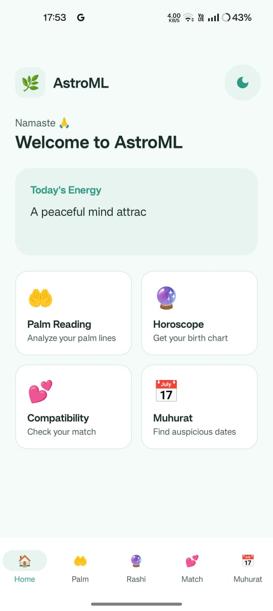
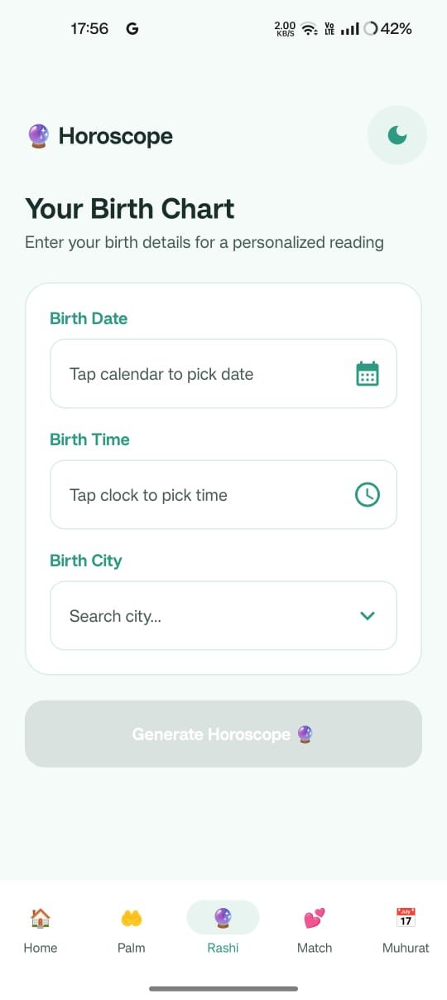
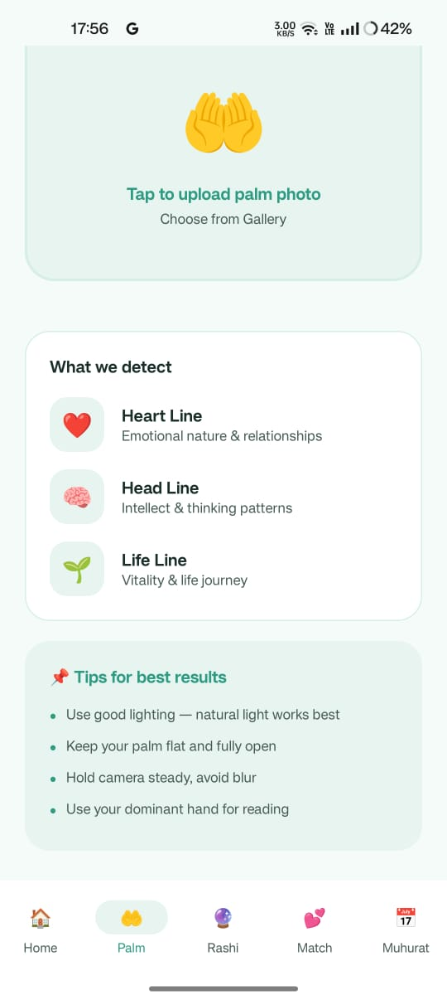
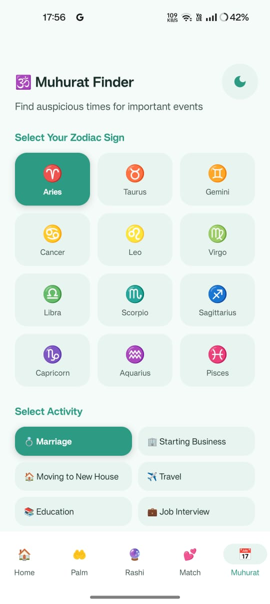

# 🔭 AstroML — Your Astrology Companion

An **astrology app** powered by machine learning that gives you personalized cosmic insights based on your birth details. Upload your photos, explore your birth chart, and discover what the stars say about you.

---

## 📸 Screenshots

  
  
  
  

---

## ✨ Features

- ✨ **Personalized Horoscopes** — daily, weekly, and monthly readings based on your sign
- 🪐 **Birth Chart Analysis** — enter your birth date, time, and place to get your full natal chart
- 🤖 **ML-Powered Insights** — machine learning model gives personalised astrological predictions
- ♈ **All 12 Zodiac Signs** — full support for every sign with detailed personality and compatibility info
- 🌙 **Moon Phase Tracker** — know the current moon phase and its astrological significance
- 🔮 **Compatibility Check** — explore compatibility between zodiac signs

---

## 🛠️ Tech Stack

| Technology | Usage |
|---|---|
| Kotlin | Primary language |
| Jetpack Compose | UI framework |
| TensorFlow Lite | ML predictions (on-device) |
| Firebase Firestore | User data & content |
| Firebase Auth | Authentication |
| Firebase Storage | Photo uploads |
| Android SDK | Platform |

---

## ⭐ If you found this helpful, give it a star!
